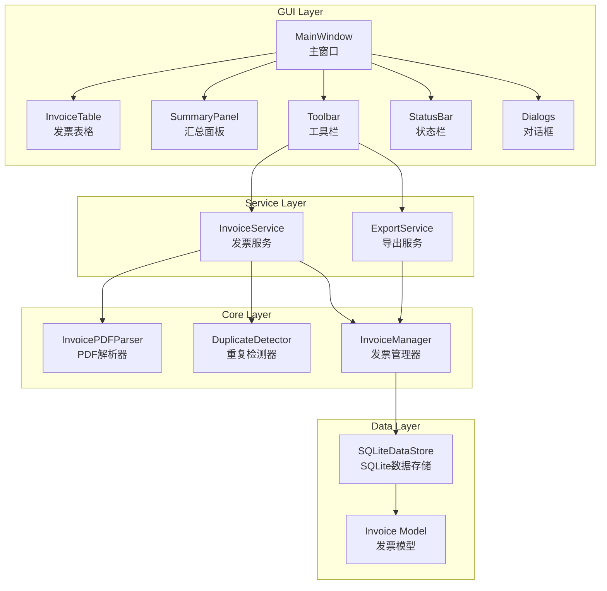

# Design Document - 电子发票汇总程序GUI与数据库升级

## Overview

本设计文档描述了将现有的命令行电子发票汇总程序升级为图形用户界面(GUI)桌面应用程序，并将JSON文件存储替换为SQLite数据库的技术方案。升级后的系统将提供更直观的用户体验和更可靠的数据存储。

## Architecture



### 技术选型

- **编程语言**: Python 3.9+
- **GUI框架**: tkinter (Python标准库，无需额外安装)
- **数据库**: SQLite3 (Python标准库，轻量级嵌入式数据库)
- **PDF解析**: pdfplumber (保持现有)
- **Excel导出**: openpyxl (保持现有)
- **测试框架**: pytest + hypothesis (保持现有)

## Components and Interfaces

### 1. SQLiteDataStore (SQLite数据存储)

替换现有的JSON DataStore，提供SQLite数据库存储功能。

```python
class SQLiteDataStore:
    """SQLite数据存储类"""
    
    DEFAULT_DB_PATH = "data/invoices.db"
    
    def __init__(self, db_path: str = None):
        """初始化数据库连接"""
        pass
    
    def _init_database(self) -> None:
        """创建数据库表结构"""
        pass
    
    def serialize_invoice(self, invoice: Invoice) -> tuple:
        """将Invoice对象序列化为数据库元组"""
        pass
    
    def deserialize_invoice(self, row: tuple) -> Invoice:
        """将数据库行反序列化为Invoice对象"""
        pass
    
    def insert(self, invoice: Invoice) -> None:
        """插入单条发票记录"""
        pass
    
    def delete(self, invoice_number: str) -> bool:
        """删除指定发票号码的记录"""
        pass
    
    def load_all(self) -> List[Invoice]:
        """加载所有发票记录"""
        pass
    
    def search(self, keyword: str) -> List[Invoice]:
        """搜索发票记录"""
        pass
```

### 2. MainWindow (主窗口)

应用程序的主界面，包含所有UI组件。

```python
class MainWindow:
    """主窗口类"""
    
    def __init__(self):
        """初始化主窗口"""
        pass
    
    def _create_menu_bar(self) -> None:
        """创建菜单栏"""
        pass
    
    def _create_toolbar(self) -> None:
        """创建工具栏"""
        pass
    
    def _create_invoice_table(self) -> None:
        """创建发票表格"""
        pass
    
    def _create_summary_panel(self) -> None:
        """创建汇总面板"""
        pass
    
    def _create_status_bar(self) -> None:
        """创建状态栏"""
        pass
    
    def refresh_table(self) -> None:
        """刷新发票表格"""
        pass
    
    def refresh_summary(self) -> None:
        """刷新汇总面板"""
        pass
    
    def show_status(self, message: str) -> None:
        """显示状态消息"""
        pass
```

### 3. InvoiceTable (发票表格组件)

基于tkinter Treeview的发票数据表格。

```python
class InvoiceTable:
    """发票表格组件"""
    
    COLUMNS = ["invoice_number", "invoice_date", "item_name", "amount", "remark"]
    
    def __init__(self, parent: tk.Frame):
        """初始化表格"""
        pass
    
    def load_data(self, invoices: List[Invoice]) -> None:
        """加载发票数据到表格"""
        pass
    
    def sort_by_column(self, column: str) -> None:
        """按列排序"""
        pass
    
    def get_selected_invoice(self) -> Optional[Invoice]:
        """获取选中的发票"""
        pass
    
    def clear(self) -> None:
        """清空表格"""
        pass
```

### 4. SummaryPanel (汇总面板)

显示发票统计信息的面板。

```python
class SummaryPanel:
    """汇总面板组件"""
    
    def __init__(self, parent: tk.Frame):
        """初始化汇总面板"""
        pass
    
    def update(self, total_count: int, total_amount: Decimal) -> None:
        """更新汇总信息"""
        pass
    
    def format_amount(self, amount: Decimal) -> str:
        """格式化金额显示"""
        pass
```

### 5. Dialogs (对话框模块)

各种对话框的实现。

```python
class InvoiceDetailDialog:
    """发票详情对话框"""
    
    def __init__(self, parent: tk.Tk, invoice: Invoice):
        pass
    
    def show(self) -> None:
        pass

class DuplicateWarningDialog:
    """重复发票警告对话框"""
    
    def __init__(self, parent: tk.Tk, new_invoice: Invoice, original_invoice: Invoice):
        pass
    
    def show(self) -> None:
        pass

class ConfirmDeleteDialog:
    """删除确认对话框"""
    
    def __init__(self, parent: tk.Tk, invoice: Invoice):
        pass
    
    def show(self) -> bool:
        """返回True表示确认删除"""
        pass
```

### 6. Updated InvoiceManager

扩展现有InvoiceManager以支持删除和搜索功能。

```python
class InvoiceManager:
    """扩展的发票管理器"""
    
    # 保持现有方法...
    
    def delete_invoice(self, invoice_number: str) -> bool:
        """删除发票"""
        pass
    
    def search_invoices(self, keyword: str) -> List[Invoice]:
        """搜索发票"""
        pass
```

## Data Models

### SQLite Database Schema

```sql
CREATE TABLE IF NOT EXISTS invoices (
    id INTEGER PRIMARY KEY AUTOINCREMENT,
    invoice_number TEXT UNIQUE NOT NULL,
    invoice_date TEXT NOT NULL,
    item_name TEXT NOT NULL,
    amount TEXT NOT NULL,
    remark TEXT,
    file_path TEXT NOT NULL,
    scan_time TEXT NOT NULL
);

CREATE INDEX IF NOT EXISTS idx_invoice_number ON invoices(invoice_number);
CREATE INDEX IF NOT EXISTS idx_invoice_date ON invoices(invoice_date);
```

### 现有数据模型 (保持不变)

| 模型 | 描述 |
|------|------|
| Invoice | 发票数据模型 |
| AddResult | 添加结果 |
| InvoiceSummary | 发票汇总 |
| BatchResult | 批量处理结果 |

## Correctness Properties

*A property is a characteristic or behavior that should hold true across all valid executions of a system-essentially, a formal statement about what the system should do. Properties serve as the bridge between human-readable specifications and machine-verifiable correctness guarantees.*

### Property 1: Database Serialization Round Trip
*For any* valid Invoice object, serializing to SQLite database format and then deserializing back SHALL produce an equivalent Invoice object with identical field values.
**Validates: Requirements 3.5, 3.6**

### Property 2: Table Displays All Invoices
*For any* set of invoices stored in the database, the Invoice_Table SHALL display all of them with complete field information (invoice_number, invoice_date, item_name, amount, remark).
**Validates: Requirements 2.1**

### Property 3: Insert Persists to Database
*For any* invoice successfully added through the GUI, the invoice SHALL be retrievable from the SQLite_Database immediately after insertion.
**Validates: Requirements 3.3**

### Property 4: Delete Removes from Database
*For any* invoice deleted through the GUI, the invoice SHALL no longer exist in the SQLite_Database after deletion.
**Validates: Requirements 7.2**

### Property 5: Summary Reflects Current Data
*For any* set of invoices displayed (filtered or unfiltered), the Summary_Panel SHALL show the correct total count and total amount matching the displayed invoices.
**Validates: Requirements 6.1, 6.2, 6.3, 8.3**

### Property 6: Search Filter Accuracy
*For any* search keyword, the filtered Invoice_Table SHALL contain only invoices where at least one field contains the search keyword.
**Validates: Requirements 8.1**

## Error Handling

### 数据库错误
- 数据库连接失败：显示错误对话框，提示用户检查数据目录权限
- 数据库写入失败：显示错误对话框，回滚事务
- 数据库查询失败：显示错误对话框，返回空结果

### GUI错误
- 文件选择取消：静默处理，不显示错误
- 无效PDF文件：显示错误对话框，继续处理其他文件
- 导出失败：显示错误对话框，提示具体原因

### 数据迁移
- 检测到旧JSON数据：提示用户是否迁移到SQLite
- 迁移失败：保留原JSON文件，显示错误信息

## Testing Strategy

### 单元测试 (pytest)

1. **SQLiteDataStore测试**
   - 测试数据库创建和初始化
   - 测试CRUD操作
   - 测试搜索功能

2. **GUI组件测试**
   - 测试表格数据加载
   - 测试汇总面板更新
   - 测试对话框显示

### 属性测试 (hypothesis)

使用 `hypothesis` 库进行属性测试，每个属性测试配置运行至少100次迭代。

每个属性测试必须使用以下格式标注：
`**Feature: gui-database-upgrade, Property {number}: {property_text}**`

1. **Property 1: Database Serialization Round Trip**
   - 生成随机Invoice对象
   - 序列化到数据库格式
   - 反序列化回Invoice对象
   - 验证结果与原始对象相等

2. **Property 2: Table Displays All Invoices**
   - 生成随机Invoice列表
   - 存入数据库
   - 加载到表格
   - 验证表格行数等于发票数量

3. **Property 3: Insert Persists to Database**
   - 生成随机Invoice
   - 通过管理器添加
   - 直接查询数据库
   - 验证记录存在

4. **Property 4: Delete Removes from Database**
   - 生成随机Invoice并添加
   - 删除该发票
   - 查询数据库
   - 验证记录不存在

5. **Property 5: Summary Reflects Current Data**
   - 生成随机Invoice列表
   - 计算预期总和和数量
   - 验证汇总面板显示正确

6. **Property 6: Search Filter Accuracy**
   - 生成随机Invoice列表和搜索关键词
   - 执行搜索
   - 验证所有结果都包含关键词
