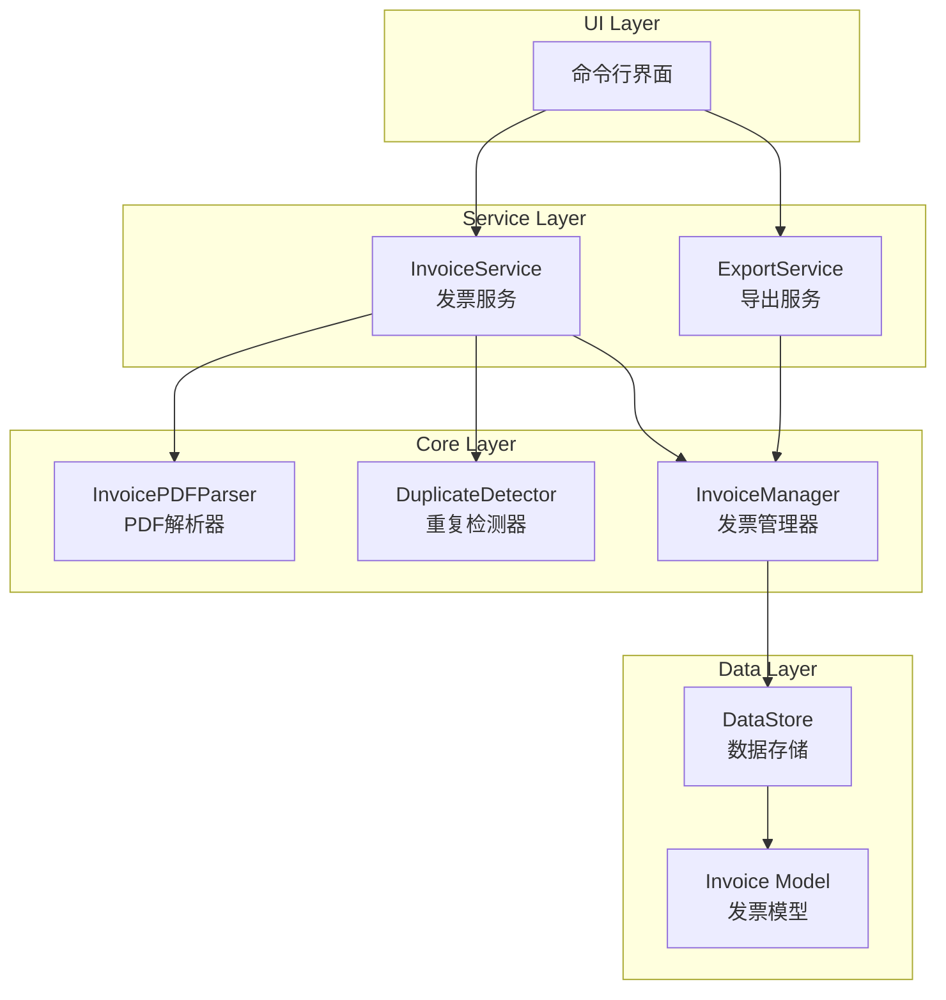

# Design Document - 电子发票汇总程序

## Overview

电子发票汇总程序是一个基于Python的桌面应用程序，用于从PDF格式的电子发票中提取关键信息并进行汇总统计。程序采用模块化设计，将PDF解析、数据管理、重复检测和导出功能分离，便于维护和扩展。

## Architecture



### 技术选型

- **编程语言**: Python 3.9+
- **PDF解析**: pdfplumber (用于提取PDF文本)
- **数据存储**: JSON文件
- **Excel导出**: openpyxl
- **测试框架**: pytest + hypothesis (属性测试)

## Components and Interfaces

### 1. Invoice Model (发票模型)

```python
@dataclass
class Invoice:
    invoice_number: str      # 发票号码
    invoice_date: str        # 开票日期 (YYYY-MM-DD)
    item_name: str           # 项目名称
    amount: Decimal          # 金额
    remark: str              # 备注
    file_path: str           # 源文件路径
    scan_time: datetime      # 扫描时间
```

### 2. InvoicePDFParser (PDF解析器)

```python
class InvoicePDFParser:
    def parse(self, file_path: str) -> Invoice:
        """解析PDF文件，提取发票信息"""
        pass
    
    def _extract_invoice_number(self, text: str) -> str:
        """从文本中提取发票号码"""
        pass
    
    def _extract_date(self, text: str) -> str:
        """从文本中提取开票日期"""
        pass
    
    def _extract_amount(self, text: str) -> Decimal:
        """从文本中提取金额"""
        pass
```

### 3. DuplicateDetector (重复检测器)

```python
class DuplicateDetector:
    def __init__(self, existing_invoices: List[Invoice]):
        self._invoice_numbers: Set[str] = set()
    
    def is_duplicate(self, invoice_number: str) -> bool:
        """检查发票号码是否重复"""
        pass
    
    def get_original(self, invoice_number: str) -> Optional[Invoice]:
        """获取原始发票信息"""
        pass
```

### 4. InvoiceManager (发票管理器)

```python
class InvoiceManager:
    def add_invoice(self, invoice: Invoice) -> AddResult:
        """添加发票，返回添加结果"""
        pass
    
    def get_all_invoices(self) -> List[Invoice]:
        """获取所有发票"""
        pass
    
    def get_summary(self) -> InvoiceSummary:
        """获取汇总信息"""
        pass
    
    def get_total_amount(self) -> Decimal:
        """计算总金额"""
        pass
    
    def get_invoice_count(self) -> int:
        """获取发票数量"""
        pass
```

### 5. DataStore (数据存储)

```python
class DataStore:
    def save(self, invoices: List[Invoice]) -> None:
        """保存发票数据到JSON文件"""
        pass
    
    def load(self) -> List[Invoice]:
        """从JSON文件加载发票数据"""
        pass
    
    def serialize_invoice(self, invoice: Invoice) -> dict:
        """将发票对象序列化为字典"""
        pass
    
    def deserialize_invoice(self, data: dict) -> Invoice:
        """将字典反序列化为发票对象"""
        pass
```

### 6. ExportService (导出服务)

```python
class ExportService:
    def export_to_excel(self, invoices: List[Invoice], output_path: str) -> None:
        """导出发票数据到Excel文件"""
        pass
    
    def format_amount(self, amount: Decimal) -> str:
        """格式化金额为两位小数"""
        pass
```

## Data Models

### Invoice (发票)

| 字段 | 类型 | 描述 |
|------|------|------|
| invoice_number | str | 发票号码（唯一标识） |
| invoice_date | str | 开票日期 (YYYY-MM-DD格式) |
| item_name | str | 项目名称 |
| amount | Decimal | 金额（精确到分） |
| remark | str | 备注信息 |
| file_path | str | 源PDF文件路径 |
| scan_time | datetime | 扫描录入时间 |

### InvoiceSummary (发票汇总)

| 字段 | 类型 | 描述 |
|------|------|------|
| invoices | List[Invoice] | 发票列表 |
| total_amount | Decimal | 总金额 |
| invoice_count | int | 发票数量 |

### AddResult (添加结果)

| 字段 | 类型 | 描述 |
|------|------|------|
| success | bool | 是否添加成功 |
| is_duplicate | bool | 是否为重复发票 |
| original_invoice | Optional[Invoice] | 原始发票（如果重复） |
| message | str | 结果消息 |

### BatchResult (批量处理结果)

| 字段 | 类型 | 描述 |
|------|------|------|
| success_count | int | 成功数量 |
| duplicate_count | int | 重复数量 |
| error_count | int | 错误数量 |
| errors | List[str] | 错误信息列表 |

## Correctness Properties

*A property is a characteristic or behavior that should hold true across all valid executions of a system-essentially, a formal statement about what the system should do. Properties serve as the bridge between human-readable specifications and machine-verifiable correctness guarantees.*

### Property 1: Serialization Round Trip
*For any* valid Invoice object, serializing to JSON and then deserializing back SHALL produce an equivalent Invoice object with identical field values.
**Validates: Requirements 1.6, 1.7**

### Property 2: Duplicate Detection Prevents Addition
*For any* invoice that is added twice with the same invoice_number, the second addition SHALL fail and the total invoice count SHALL remain unchanged.
**Validates: Requirements 2.1, 2.2**

### Property 3: Summary Contains All Invoices
*For any* set of unique invoices added to the system, the summary view SHALL contain all of them with complete field information (invoice_number, invoice_date, item_name, amount, remark).
**Validates: Requirements 3.1**

### Property 4: Total Amount Equals Sum
*For any* set of invoices in the system, the total amount displayed SHALL equal the arithmetic sum of all individual invoice amounts.
**Validates: Requirements 3.2**

### Property 5: Invoice Count Accuracy
*For any* set of unique invoices added to the system, the displayed count SHALL equal the exact number of unique invoices.
**Validates: Requirements 3.3**

### Property 6: Export Contains All Records
*For any* set of invoices in the system, the exported Excel file SHALL contain exactly the same number of records as the invoice count.
**Validates: Requirements 4.1**

### Property 7: Amount Formatting
*For any* Decimal amount value, the formatted string SHALL contain exactly two decimal places.
**Validates: Requirements 4.3**

### Property 8: Batch Processing Counts
*For any* batch of PDF files processed, the sum of success_count, duplicate_count, and error_count SHALL equal the total number of files in the batch.
**Validates: Requirements 5.2**

## Error Handling

### PDF解析错误
- 文件不存在：抛出 `FileNotFoundError`，记录日志
- 文件格式错误：抛出 `InvalidPDFError`，记录日志并继续处理其他文件
- 信息提取失败：返回部分提取结果，标记缺失字段

### 数据存储错误
- 文件写入失败：抛出 `IOError`，提示用户检查磁盘空间和权限
- JSON解析失败：抛出 `DataCorruptionError`，尝试从备份恢复

### 导出错误
- Excel写入失败：抛出 `ExportError`，提示用户检查文件是否被占用

## Testing Strategy

### 单元测试 (pytest)

单元测试用于验证特定示例和边界情况：

1. **PDF解析测试**
   - 测试已知格式的发票PDF提取
   - 测试缺失字段的处理
   - 测试无效PDF文件的错误处理

2. **数据模型测试**
   - 测试Invoice对象创建
   - 测试字段验证

3. **导出测试**
   - 测试Excel文件生成
   - 测试空数据导出

### 属性测试 (hypothesis)

属性测试用于验证在所有有效输入上都应成立的通用属性。使用 `hypothesis` 库进行属性测试，每个属性测试配置运行至少100次迭代。

每个属性测试必须使用以下格式标注：
`**Feature: invoice-summary, Property {number}: {property_text}**`

1. **Property 1: Serialization Round Trip**
   - 生成随机Invoice对象
   - 序列化后反序列化
   - 验证结果与原始对象相等

2. **Property 2: Duplicate Detection Prevents Addition**
   - 生成随机Invoice
   - 添加两次相同invoice_number
   - 验证第二次添加失败且计数不变

3. **Property 3: Summary Contains All Invoices**
   - 生成随机Invoice列表
   - 添加到系统
   - 验证汇总包含所有发票

4. **Property 4: Total Amount Equals Sum**
   - 生成随机Invoice列表
   - 计算预期总和
   - 验证系统总金额与预期相等

5. **Property 5: Invoice Count Accuracy**
   - 生成随机唯一Invoice列表
   - 验证计数准确

6. **Property 6: Export Contains All Records**
   - 生成随机Invoice列表
   - 导出Excel
   - 验证记录数量一致

7. **Property 7: Amount Formatting**
   - 生成随机Decimal金额
   - 格式化
   - 验证结果有两位小数

8. **Property 8: Batch Processing Counts**
   - 生成随机文件列表（包含有效、重复、无效）
   - 批量处理
   - 验证计数总和等于文件数
