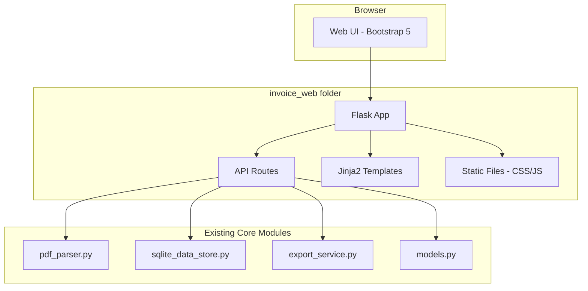

# Design Document: Invoice Web Application

## Overview

本设计将现有的桌面版电子发票汇总系统转换为Web应用。采用Flask作为后端框架，Bootstrap 5作为前端UI框架，实现简洁美观的响应式界面。所有Web相关代码将整合到`invoice_web`文件夹中，复用现有的核心业务模块。

### 技术栈

- **后端**: Flask (Python Web框架)
- **前端**: Bootstrap 5 + 原生JavaScript
- **数据库**: SQLite (复用现有sqlite_data_store)
- **PDF解析**: 复用现有pdf_parser模块
- **Excel导出**: 复用现有export_service模块

## Architecture



## Components and Interfaces

### 1. Flask Application (`invoice_web/app.py`)

主应用入口，配置Flask实例和路由。

```python
class InvoiceWebApp:
    """Web应用主类"""
    
    def __init__(self, data_store=None):
        self.app = Flask(__name__)
        self.data_store = data_store or SQLiteDataStore()
        self.invoice_manager = InvoiceManager(self.data_store)
        self.pdf_parser = InvoicePDFParser()
        self.export_service = ExportService()
```

### 2. API Routes (`invoice_web/routes.py`)

RESTful API端点：

| Endpoint | Method | Description |
|----------|--------|-------------|
| `/` | GET | 主页面，显示发票列表 |
| `/api/invoices` | GET | 获取所有发票（支持搜索参数） |
| `/api/invoices/<number>` | GET | 获取单个发票详情 |
| `/api/invoices` | POST | 上传并添加发票 |
| `/api/invoices/<number>` | DELETE | 删除发票 |
| `/api/invoices/export` | GET | 导出Excel文件 |
| `/api/invoices/<number>/pdf` | GET | 下载原始PDF文件 |
| `/api/summary` | GET | 获取统计汇总 |

### 3. Frontend Templates (`invoice_web/templates/`)

- `base.html` - 基础模板，包含Bootstrap引用
- `index.html` - 主页面，发票列表和操作界面

### 4. Static Files (`invoice_web/static/`)

- `css/style.css` - 自定义样式
- `js/app.js` - 前端交互逻辑

## Data Models

复用现有`src/models.py`中的数据模型：

### Invoice (发票)

```python
@dataclass
class Invoice:
    invoice_number: str    # 发票号码（唯一标识）
    invoice_date: str      # 开票日期 (YYYY-MM-DD)
    item_name: str         # 项目名称
    amount: Decimal        # 金额
    remark: str            # 备注
    file_path: str         # 源PDF文件名（用于下载时的文件名）
    scan_time: datetime    # 扫描时间
```

### PDF Storage (PDF存储)

PDF文件将以BLOB形式存储在SQLite数据库中，需要扩展现有的数据库表结构：

```sql
ALTER TABLE invoices ADD COLUMN pdf_data BLOB;
```

新增字段：
- `pdf_data`: 存储PDF文件的二进制内容

### API Response Models

```python
# 发票列表响应
{
    "invoices": [...],
    "total_count": int,
    "total_amount": str
}

# 添加发票响应
{
    "success": bool,
    "is_duplicate": bool,
    "message": str,
    "invoice": {...} | null,
    "original_invoice": {...} | null
}

# 删除响应
{
    "success": bool,
    "message": str
}
```

## Correctness Properties

*A property is a characteristic or behavior that should hold true across all valid executions of a system-essentially, a formal statement about what the system should do. Properties serve as the bridge between human-readable specifications and machine-verifiable correctness guarantees.*

### Property 1: Invoice Persistence Round Trip

*For any* valid invoice data, after adding it to the system, querying the invoice list SHALL return that invoice with all fields intact.

**Validates: Requirements 1.2, 2.3**

### Property 2: Duplicate Prevention

*For any* invoice, adding it twice with the same invoice number SHALL result in exactly one entry in the database, with the second add returning a duplicate flag.

**Validates: Requirements 3.1, 3.3**

### Property 3: Delete Removes Invoice

*For any* invoice in the system, after deletion, querying for that invoice SHALL return no results.

**Validates: Requirements 5.2**

### Property 4: Search Completeness

*For any* invoice and any substring of its searchable fields (invoice_number, invoice_date, item_name, amount, remark), searching with that substring SHALL include that invoice in the results.

**Validates: Requirements 6.1, 6.2**

### Property 5: Empty Search Returns All

*For any* set of invoices in the database, searching with an empty string SHALL return all invoices.

**Validates: Requirements 6.3**

### Property 6: Statistics Accuracy

*For any* set of invoices, the reported total_count SHALL equal the actual number of invoices, and total_amount SHALL equal the sum of all invoice amounts.

**Validates: Requirements 7.1, 7.2, 7.3**

### Property 7: Sort Ordering

*For any* sortable column and any set of invoices, sorting by that column SHALL return invoices ordered by that column's values, and sorting again SHALL reverse the order.

**Validates: Requirements 9.1, 9.2**

### Property 8: Invoice Detail Completeness

*For any* invoice, the detail response SHALL contain all required fields: invoice_number, invoice_date, item_name, amount, remark, file_path, and scan_time.

**Validates: Requirements 4.2**

### Property 9: Export Completeness

*For any* set of invoices, the exported Excel file SHALL contain all invoices with all specified columns.

**Validates: Requirements 8.3**

### Property 10: PDF Storage Round Trip

*For any* uploaded PDF file, the stored PDF data SHALL be retrievable and identical to the original uploaded content.

**Validates: Requirements 2.6, 2.7, 10.2**

## Error Handling

### Backend Errors

| Error Type | HTTP Status | Response |
|------------|-------------|----------|
| Invalid PDF | 400 | `{"success": false, "message": "无法解析PDF文件"}` |
| Duplicate Invoice | 409 | `{"success": false, "is_duplicate": true, ...}` |
| Invoice Not Found | 404 | `{"success": false, "message": "发票不存在"}` |
| Server Error | 500 | `{"success": false, "message": "服务器错误"}` |

### Frontend Error Display

- 使用Bootstrap Toast组件显示错误消息
- 错误消息使用红色背景，成功消息使用绿色背景
- 自动消失时间：3秒

## Testing Strategy

### Unit Testing

使用pytest进行单元测试：

- 测试API端点的请求/响应
- 测试发票序列化/反序列化
- 测试错误处理逻辑

### Property-Based Testing

使用Hypothesis库进行属性测试：

- 每个属性测试运行至少100次迭代
- 测试文件位于`tests/test_invoice_web_properties.py`
- 每个测试使用注释标注对应的设计文档属性

**测试标注格式**: `**Feature: invoice-web-app, Property {number}: {property_text}**`

### Test Coverage

- API端点测试覆盖所有路由
- 属性测试覆盖核心业务逻辑
- 边界条件测试（空数据、大数据量等）
